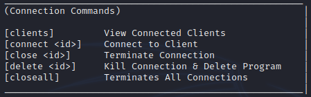
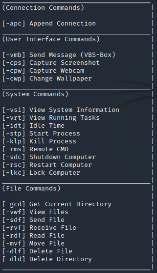
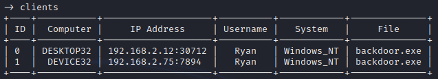
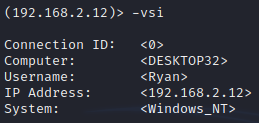

# Windows Remote Access Tool
A Hidden and Undetectable Remote Access Tool written in C++ and Server in Python3

This program utilizes the standard winsock library for sending and receiving data back and forth between the server and client. The server can manage multiple connections at once with the use of multi-threading having an easy time switching to other remote machines simply, in order to control it from a command line view.
  
Constants in Client Program:
- <b>server</b>: Specify server's IP address here
- <b>startup</b>: If enabled, copies itself to the client's startup folder upon runtime.
- <b>timeout</b>: Restarts client if no data is received after a specified period of time (default: 5 minutes)

# Client Requirements
-  Operating System: Windows
-  Compiler: C++ MinGW 64-Bit

# Server View
 
 
 

# Usage
- Run the 'server.py' file on your own machine you would like to control the remote client from
- Compile the 'client.cpp' file after specifying it's server host and port
- Execute the compiled 'client.exe' file on your targets machine

# Compile C++ Program
- g++ client.cpp -mwindows -o client -lws2_32 -lstrmiids -lole32 -loleaut32 -static-libgcc -static-libstdc++ -static

# Contributing
- Feel free to submit any possible bugs as I will be glad to respond to anyone and help with whatever's needed to further improve this program